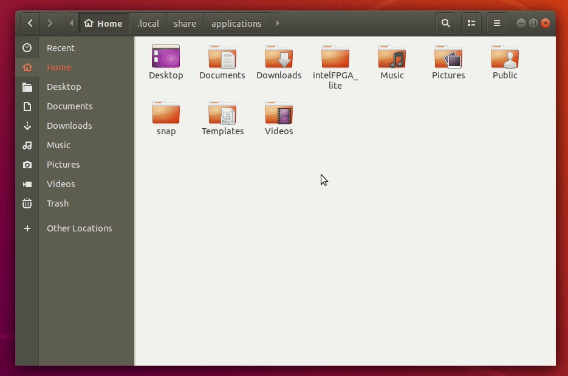

# How to install Quartus Prime in all platforms

## Windows

The first thing you need to know before downloading the software is which package to choose. I recommend that you download the Combined Files with all devices because if you download the individual files, some software, such as ModelSim, may cause a path error in Quartus Prime, as they will be installed in /intelFPGA instead of /intelFPGA_lite with Quartus Prime. If you still want to do a clean install, I'll talk about it at the end.

[Quartus Prime download link.](https://fpgasoftware.intel.com/?edition=lite)

## Ubuntu

### Preparing the operating system

First of all, it is important to keep the system up to date. Run the commands below: 

    $ sudo apt update
    $ sudo apt upgrade

Quartus Prime uses some old libraries, still in the 32-bit standard. To make the system compatible with those libraries, run the commands below to add the 32-bit architecture and some more libraries:

    $ sudo dpkg --add-architecture i386
    $ sudo apt update
    $ sudo apt install libxft2:i386 libxext6:i386 libncurses5:i386 bzip2:i386

### Additional package

This additional package is needed for using the ModelSim-Altera. So, it isn't necessary for those how will not use ModelSim and can be installed in the future.

    $ sudo apt install g++-multilib 

**NOTE**: This may be causing an error because it's a 32bit program (ModelSim) running on a 64bit system.

### Downloading the Software

To avoid errors and simplify the installation, download Quartus through the Combined Files tab. Download link: https://fpgasoftware.intel.com/?edition=lite

TIP: use Firefox to download, as it is one of the fastest browsers

### Installation

After downloading, go to the folder were Quartus was downloaded and extract the ***.tar*** file (this may take a while). Enter the folder that was extracted and right-click on the ***setup.sh*** file, go to properties, then permissions and ensure that reading and writing is enabled in all fields, as well as allowing you to run the file as a program.

Then in the same directory, right-click on any blank space in the file manager, click open in the terminal, and type:

    $ ./setup.sh
 
After a few moments, the Quartus installation window will appear.

**NOTE**: do not close the terminal as it is running the installer.

Just like any Windows installation, click next until the program starts to be installed. Once installed, just close the installer and wait for Quartus to run for the first time. This first time a message will appear related to the software license, but just click on “run the Quartus Prime software” and wait to load.

At this point, Quartus Prime is already installed on the system and can now be used as an IDE.

**NOTE**: the terminal used to run the installer can now be closed

### Permissions

The next step is to permit for Quartus to access the USB Blaster used to load the programs on the FPGA. To give the necessary permissions, open a new terminal, and use the commands below:

    $ cd /etc/udev/rules.d
    $ sudo nano 51-usbblaster.rules

After that last command, the Nano program, which is a text editor, will open in the terminal. Copy the instructions below and use *Ctrl+Shift+V* to paste into the Nano.

    SUBSYSTEM=="usb", ATTRS{idVendor}=="09fb", ATTRS{idProduct}=="6001", MODE="0666"
    SUBSYSTEM=="usb", ATTRS{idVendor}=="09fb", ATTRS{idProduct}=="6002", MODE="0666"
    SUBSYSTEM=="usb", ATTRS{idVendor}=="09fb", ATTRS{idProduct}=="6003", MODE="0666"
    SUBSYSTEM=="usb", ATTRS{idVendor}=="09fb", ATTRS{idProduct}=="6010", MODE="0666"
    SUBSYSTEM=="usb", ATTRS{idVendor}=="09fb", ATTRS{idProduct}=="6810", MODE="0666" 

After pasting the text, use ***Ctrl+O*** to write to the file, ***Enter*** to save and ***Ctrl+X*** to exit Nano.

The installation is almost complete, but if you are on a virtual machine, you will have to turn it off to insert the USB Blaster, already connected to the FPGA, to the list of devices on your machine. After that, just turn it back on.

### Creating the icon

The next step will be to integrate the Quartus to your system. To do this, open your file manager, go to ***Home***, then click on the hamburger menu in the upper right corner and select the option to show hidden files. Go to ***/.local/share/applications*** and paste the ***.desktop*** file created on the desktop in that folder.

#### Creating .desktop file

If no ***.desktop*** file was created, you must do it manually. So, to do that, already in the ***/.local/share/applications/*** folder, click on a blank space and open it in the terminal. Then run the command below:

    $ nano 'Quartus Prime Lite.desktop'

The next step is to right-click on the file created in the file manager, then click open with another application, and finally, click open with the text editor. Copy the information below to the text editor that was opened, exchange ***USER*** in all paths for your user. Don't forget to update the version number of your software. In this case, the version was ***20.1***. After that, save and close the file.

    [Desktop Entry]
    Type=Application
    Version=0.9.4
    Name=Quartus Prime Lite
    Comment=Quartus (Quartus Prime 20.1)
    Icon=/home/USER/intelFPGA_lite/20.1/quartus/adm/quartusii.png
    Exec=/home/USER/intelFPGA_lite/20.1/quartus/bin/quartus --64bit
    Terminal=false
    Path=/home/USER/intelFPGA_lite/20.1
    Name[en_US]=Quartus Prime Lite

#### Add .desktop file to the system

The file is already in the right place, it just needs to be added to the list of applications. For that, if there is already a file in this folder called ***defaults.list***, just open it with a text editor of your choice and add the following instruction: ***Quartus (Quartus Prime 20.1) Lite Edition.desktop***. But, if you had to create the ***.desktop*** file manually, the instruction will be: ***Quartus Prime Lite.desktop***

If there are no ***defaults.list***, you will need to create it. To do this, right-click on any blank space in the file and open it in the terminal. Enter this command: 

    $ nano defaults.list 

This will open the already mentioned text editor. Now just add the already commented instruction and follow the same steps as before to write, save, and exit.

After adding the ***.desktop*** file, it's time to update the list of Ubuntu applications and run this command:

    $ sudo update-mime-database /usr/share/mime

NOTE: this command does not bring any output to the terminal

After running the command, Quartus will already be integrated into your system. To open it, just search for Quartus in your application tab. This also allows it to be added to the bookmarks bar.

### Uninstallation

Go to ***/home/intelFPGA_lite/20.1/uninstall/***, right-click on the file quartus_lite-uninstall.run, go to properties, then permissions and allow reading and writing for all options, and allowing to run as a program.

After giving the necessary permissions, double click on the file and wait for the uninstall window to appear. Then just click on next until the uninstall is complete.

### Errors correction

The only mistake I came across after installation is about Quartus not being able to connect on the site to search for updates. This is easy to get around. Go to ***Tools->Options->InternetConnectivity*** and uncheck the option that asks to check for updates, then click OK and the next time you open Quartus you will not have any errors.

## Arch Linux

From the Arch repository (*AUR*).

## Path error

This error may appear if you installed it from the Individual Files. So, what happens is the ModelSim could be installed in /intelFPGA instead of /intelFPGA_lite. What you have to do for making this right is to update the ModelSim path on Quartus Prime. For do that, you have to go to Quartus Prime in Tools->Options->General->EDAToolOptions and add the following path to the ModelSim: C:\intelFPGA_lite\XX.X\modelsim_ase\win32aloem. Were XX.X is the version of the Quartus Prime.